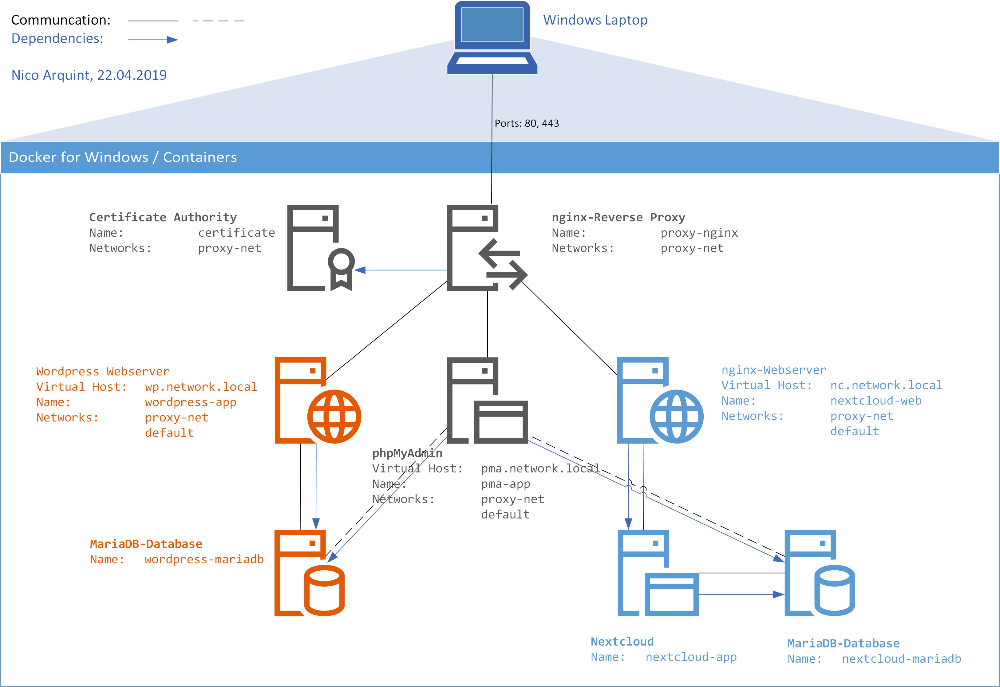
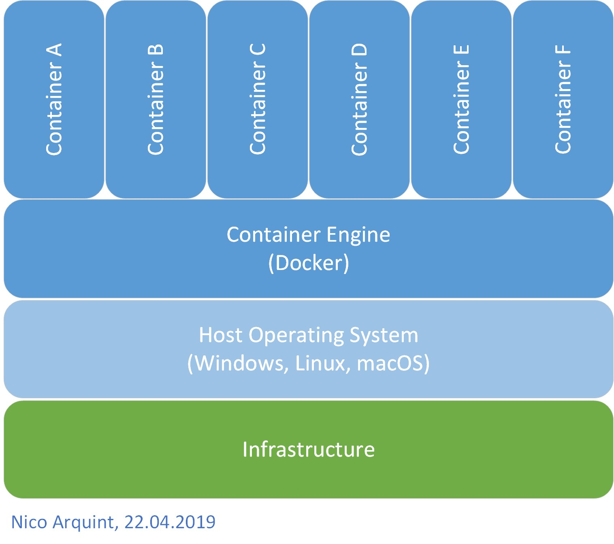
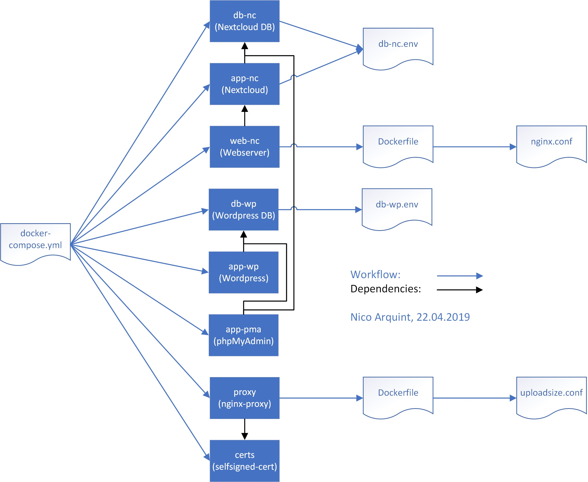

# TBZ-M300-LB3

[](https://travis-ci.org/NiArq/TBZ-M300-LB3)

Anderes Repository (LB2): <https://github.com/NiArq/TBZ-M300>

<br>

## Inhaltsverzeichnis

- [TBZ-M300-LB3](#tbz-m300-lb3)
  - [Inhaltsverzeichnis](#inhaltsverzeichnis)
  - [K1 - Toolumgebung](#k1---toolumgebung)
    - [Docker for Windows](#docker-for-windows)
    - [Hyper-V](#hyper-v)
  - [K2 - Infrastruktur](#k2---infrastruktur)
    - [Containerisierung](#containerisierung)
    - [Docker](#docker)
    - [Microservices](#microservices)
  - [K3 - Container](#k3---container)
    - [Container](#container)
    - [Volumes](#volumes)
    - [Netzwerkplan](#netzwerkplan)
      - [Legende](#legende)
      - [Netzwerk](#netzwerk)
    - [Schichtenmodell](#schichtenmodell)
    - [Workflow](#workflow)
    - [Umgebungsvariablen](#umgebungsvariablen)
    - [Häufige Befehle](#häufige-befehle)
    - [Testfälle](#testfälle)
  - [K4 - Sicherheit](#k4---sicherheit)
    - [Service-Überwachung](#service-Überwachung)
    - [Aktive Benachrichtigung](#aktive-benachrichtigung)
    - [Container Absicherung](#container-absicherung)
      - [Beispiele](#beispiele)
  - [K5 - Allgemein](#k5---allgemein)
    - [Vergleich Vorwissen - Wissenszuwachs](#vergleich-vorwissen---wissenszuwachs)
      - [Docker-Compose](#docker-compose)
      - [Continuous Integration](#continuous-integration)
    - [Reflexion](#reflexion)
  - [K6 - Zusatz](#k6---zusatz)
    - [Umfangreiche Vernetzung](#umfangreiche-vernetzung)
    - [Image-Bereitstellung](#image-bereitstellung)
      - [.dockerignore](#dockerignore)
    - [Continuous Integration](#continuous-integration-1)

<br>
<br>

## K1 - Toolumgebung
VS Code, Git-Client, Markdown-Editor und SSH-Keys gleichbleibend wie in [LB2](..\LB2).

| Kategorie              | Produkt                                              |
| ------------------     | ---------------------------------------------------- |
| Versionsverwaltung     | [Git](https://git-scm.com/)                          |
| Hypervisor             | Hyper-V by Windows (Windows Feature)                 |
| Container Engine       | [Docker for Windows](https://www.docker.com/)        |
| Editor / IDE           | [Visual Studio Code](https://code.visualstudio.com/) |
| Markdown-Editor        | [Typora](https://typora.io/)                         |
| Continuous Integration | [Travis CI](https://travis-ci.org)                   |

<br>

### Docker for Windows
Im Gegensatz zu LB2 habe ich mich entschieden, [Docker for Windows](https://www.docker.com/) zu installieren, statt eine Linux-VM mit Docker über Vagrant/Virtualbox laufen zu lassen. \
Das aus dem simplen Grund, dass alles nur noch komplizierter wird, wenn ich zusätzlich noch eine VM zwischen mir und den Container habe. Ebenfalls habe ich auch schon von den anderen Mitschülern gehört, dass sie mit der Linux-VM und Docker Probleme haben, da sie zusätzlich noch mit der VM klarkommen müssen.

<br>

### Hyper-V
Und weil ich _Docker for Windows_ verwende, musste ich den Hypervisor von VirtualBox zu Hyper-V von Windows wechseln (andere Hypervisor werden nicht unterstützt). Dazu muss lediglich das Windows-Feature aktiviert werden (mit der Docker-Installtion wird das automatisch aktiviert).


Voraussetzung für Docker und Hyper-V ist, dass man Windows 10 Pro/Education/Enterprise hat. Da Hyper-V nur auf diesen Versionen verfügbar ist.

<br>
<br>

## K2 - Infrastruktur

|        |                                   |
| ------ | --------------------------------- |
| GitHub | https://github.com/NiArq/TBZ-M300 |
| Git    | https://git-scm.org/              |

<br>

### Containerisierung
Zuvor hatte ich nie grossartig mit Container gearbeitet. Durch die Applikationsentwickler im Betrieb kannte ich schon vorher ein wenig was ein Container ist.

Im Gegensatz zu VMs benötigen Container keine Hypervisor und sind ziemlich ressourcensparend. Sind aber jedoch in gewissen Hinsichten eingeschränkt(er). \
Erwähnenswert ist auch, dass sobald ein Container heruntergefahren wird, alle Daten dabei gelöscht werden. Bei einer VM bleiben die Daten im Normalfall bestehen.

Zudem gewährleisten Container die Trennung/Verwaltung der genutzten Ressourcen. Ebenfalls können so Programme ausgeführt werden, welche sich in einer geschützen Umgebung befinden. Sollte etwas schieflaufen (Hacker, Virus, etc.), passiert dem Host-System (und den anderen Containern) nichts.

<br>

### Docker
Ich kannte zwar _Docker_ schon vorher, hatte es aber noch nie verwendet. Ich wusste dass es mit Container arbeitet und dass wir es im Betrieb einzesetzen, mehr aber nicht.

Docker ist eine OpenSource-Software, welches die Bereitstellung von Anwendungen vereinfacht. Es arbeitet mit Container, welche die Anwendung inkl. Abhänigkeiten beinhalten. Somit ist es ziemlich leicht das Ganze zu transportieren und zu installieren.

Um ein Container auf Docker zu erstellen, muss man ein _Dockerfile_ erstellen (ähnlich wie bei Vagrant). Aber im Gegensatz zu Vagrant enthält es nur einfache Befehle (FROM, COPY, USER, RUN) und kommuniziert mit keinem Hypervisor. Sobald man sein Dockerfile hat, muss das zuerst zu einem Image "gebaut" werden. Anschliessend kann damit ein Container erstellt und gestartet werden. Optional kann man sein Image auch benennen und auf Docker Hub veröffentlichen.

Die Applikationsentwickler bei uns verwenden es unter anderem um ihre Applikationen zu testen.

<br>

### Microservices
Man unterscheidet heutzutage zwischen zwei Architekturen:
- Monolithische Architektur
- Microservice Architektur

Eine monolithische Applikation kann meist nur _horizontal_ erweitert werden (mehr Leistung --> CPU, RAM, Speicher, etc.). Hingegen ein Microservice sich auch über mehrere Host erweitern lässt (_horizontal_). Zudem können bei einer Microservice-Applikation auch nur die einzelnen Services hochskaliert werden.

Bei Applikationen basierend auf Microservices ist die ganze Applikation in verschiedene kleine "Sub-Applikationen" (sog. _Microservices_) aufgeteilt.

Beispielsweise bei einem Online-Shop benötigt es einen Weboberfläche, die Buchhaltung, den Bestand und die Lieferung. \
Diese können nun in 4 Microservices aufgeteilt werden: Weboberfäche, Buchhaltung, Bestand und Lieferung. \
Das führt dazu, dass die Programmierung und Wartung der ganzen Applikation einfacher wird, da das Ganze in 4 Services aufgeteilt wurden. Der Nachteil ist, dass eine Schnittstelle für die Kommunkation zwischen den Microservices benötigt wird und dass die Services auch bei Teil-Ausfällen funktionieren müssen (--> kein Abstürzen).

<br>
<br>

## K3 - Container

### Container
Es werden insgesamt 8 Container via `docker-compose.yml` aufgebaut:

| Container | Verwendung              |
| --------- | ----------------------- |
| `db-nc`   | Datenbank für Nextcloud |
| `app-nc`  | Nextcloud Applikation   |
| `web-nc`  | Webserver für Nextcloud |
| `db-wp`   | Datenbank für Wordpress |
| `app-wp`  | Wordpress Applikation   |
| `app-pma` | phpMyAdmin              |
| `proxy`   | nginx-Reverse Proxy     |
| `certs`   | Self-signed Zertifikat  |

Es werden dabei keine Dockerfiles genutzt, stattdessen wird alles mittels `docker-compose` gelöst.

<br>

### Volumes
Damit die Daten beim stoppen nicht verloren gehen, werden mittel Volumes persistente Speicher erstellt:

| Volume                    | Nutzung                       |
| ------------------------- | ----------------------------- |
| `db-nc`                   | Speicher für die Nextcloud DB |
| `nextcloud`               | Nextcloud Daten               |
| `./web-nc/nginx.conf`     | nginx.conf für `web-nc`       |
| `db-wp`                   | Speicher für die Wordpress DB |
| `wp-data`                 | Wordpress Daten               |
| `certs`                   | Zertifikate                   |
| `./proxy/uploadsize.conf` | uploadsize.conf für `proxy`   |
| `vhost.d`                 | nginx-proxy Daten             |
| `html`                    | nginx-proxy Daten             |
| `/var/run/docker.sock`    | Docker-Daemon Socket (API)    |


<br>

### Netzwerkplan
<kbd></kbd> \
*Abbildung 1: Netzwerkplan der Umsetzung*

Wie im Netzwerkplan ersichtlich - und wie in [K1](#K1) bereits beschrieben - wird Docker nicht in einer VM, sondern direkt auf dem OS laufen gelassen.

#### Legende
Die schwarzen Pfeile zeigen die Kommunikation (vgl. Kabel in einem "Hardware"-Netzwerkplan). Die blauen Pfeile zeigen die Abhängigkeiten (kann nur starten, sofern die Abhänigkeit gestartet ist).

#### Netzwerk
Da alle Container mit einem docker-compose.yml gebaut werden, können alle untereinander intern kommunizieren. Wird kein Port oder Netzwerk definiert, können die Container nicht nach aussen interagieren. Beispielsweise müssen alle Webserver (web-nc, app-wp, app-pma) das Netzwerk des Proxys und zusätzlich den "default"-Netzwerk haben, da sie ansonsten keine Verbindung aufbauen können.

<br>

### Schichtenmodell
<kbd></kbd> \
*Abbildung 2: Verwendetes Schichtenmodell --> ohne VirtualBox/Vagrant*

Das Schichtenmodell zeigt lediglich den Aufbau von _Docker für Windows_. Zu unterst die Infrastruktur/Hardware, danach ein Betriebssysten, Container Engine/Docker und darauf die Container.

<br>

### Workflow
<kbd></kbd> \
*Abbildung 3: Workflow*

Es wird eine `docker-compose.yml`-Datei verwendet, um mehrere Container zu erstellen. In der Abbildung 3 sieht man den Workflow zur Container-Aufbau. \
Die YAML-Datei erstellt die Container, resp. baut sie nach hinterlegten Dockerfile auf, welche wiederum ggf. auf Datein zugreifen können.

<br>

### Umgebungsvariablen

Die Umgebungsvariablen werden entweder direkt im `docker-compose.yml` oder in einem `.env`-File definiert. \
Verwendete Umgebungsvariablen:

| Env-Variable            | Nutzende Container            | Beschreibung                                 |
| ----------------------- | ----------------------------- | -------------------------------------------- |
| `MYSQL_ROOT_PASSWORD`   | `db-nc`, `app-nc`, `db-wp`    | Root-Passwort für die MariaDB-Datenbank      |
| `MYSQL_PASSWORD`        | `db-nc`, `app-nc`, `db-wp`    | Passwort für den erstellten User             |
| `MYSQL_DATABASE`        | `db-nc`, `app-nc`, `db-wp`    | Zu erstellende Datenbank                     |
| `MYSQL_USER`            | `db-nc`, `app-nc`, `db-wp`    | Zu erstellender User                         |
| `VIRTUAL_HOST`          | `web-nc`, `app-wp`, `app-pma` | Hostname/(Sub-)Domain des Containers (Proxy) |
| `WORDPRESS_DB_HOST`     | `app-wp`                      | DB Host (Container Name)                     |
| `WORDPRESS_DB_USER`     | `app-wp`                      | DB User                                      |
| `WORDPRESS_DB_NAME`     | `app-wp`                      | DB Name                                      |
| `WORDPRESS_DB_PASSWORD` | `app-wp`                      | DB Datenbank                                 |
| `PMA_HOSTS`             | `app-pma`                     | Datenbanken für phpMyAdmin (Container Namen) |
| `SSL_SUBJECT`           | `certs`                       | Domain für das Zertifikat                    |
| `CA_SUBJECT`            | `certs`                       | Antragssteller                               |
| `SSL_KEY`               | `certs`                       | Speicherort .key-File                        |
| `SSL_CSR`               | `certs`                       | Speicherort .csr-File                        |
| `SSL_CERT`              | `certs`                       | Speicherort .crt-File                        |


<br>

### Häufige Befehle

**Docker**

| Befehl         | Beschreibung                                    |
| -------------- | ----------------------------------------------- |
| `docker run`   | Führt einen Befehl in einem neuen Container aus |
| `docker start` | Startet einen oder mehrere Container            |
| `docker stop`  | Stoppt einen oder mehrere Container             |
| `docker build` | Baut eine Image aus dem Dockerfile              |
| `docker pull`  | Lädt Image aus einer Repository herunter        |
| `docker push`  | Lädt Image in eine Repository hoch              |

Wenn man `docker` in die Befehlszeile eingibt, erhält man eine Übersicht aller Befehle. \


**Docker-Compose**

| Befehl                   | Beschreibung                               |
| ------------------------ | ------------------------------------------ |
| `docker-compose build`   | Baut Service auf                           |
| `docker-compose up`      | Erstellt und startet Container             |
| `docker-compose down`    | Stoppt und entfernt Container, inkl. Daten |
| `docker-compose events`  | Real-Time Logs                             |
| `docker-compose kill`    | "Killt" Container (erzwingt Stop)          |
| `docker-compose pause`   | Pausiert Service                           |
| `docker-compose restart` | Startet Service neu                        |
| `docker-compose start`   | Startet Container                          |
| `docker-compose stop`    | Stoppt Container                           |

Wenn man `docker-compose` in die Befehlszeile eingibt, erhält man eine Übersicht aller Befehle.

<br>

### Testfälle
**Testfall 1: Websites aufrufen** \
Voraussetzungen: Container sind gestartet.

| Nr. | Testfall                                           | Erwartet                                        | Effektiv                          |   OK   |
|:---:|----------------------------------------------------|-------------------------------------------------|-----------------------------------|:------:|
| 1.1 | Nextcloud aufrufbar: <br>http://nc.network.local   | Seite wird geöffnet <br>Keine 500-Fehlermeldung | Seite wird ohne Probleme geöffnet | **OK** |
| 1.2 | Wordpress aufrufbar: <br>http://wp.network.local   | Seite wird geöffnet <br>Keine 500-Fehlermeldung | Seite wird ohne Probleme geöffnet | **OK** |
| 1.3 | phpMyAdmin aufrufbar: <br>http://pma.network.local | Seite wird geöffnet <br>Keine 500-Fehlermeldung | Seite wird ohne Probleme geöffnet | **OK** |


**Testfall 2: Proxy** \
Voraussetzungen: Container sind gestartet.

| Nr. | Testfall                                       | Erwartet                                                                   | Effektiv                                            |   OK   |
|:---:|------------------------------------------------|----------------------------------------------------------------------------|-----------------------------------------------------|:------:|
| 2.1 | Ports 80, 443 offen: <br>HTTP/S-Seite aufrufen | Seite werden geöffnet <br>Keine Fehlermeldungen (ausser Zerti)             | Seite wird ohne Probleme geöffnet                   | **OK** |
| 2.2 | HTTP-Weiterleitung: <br>HTTP --> HTTPS         | Wird die HTTP-Seite aufgerufen, <br>wird man zur HTTPS-Seite weitergleitet | Alle HTTP-Seiten werden <br>zu HTTPS weitergeleitet | **OK** |

<br>
<br>

## K4 - Sicherheit

### Service-Überwachung
Für die Container-Überwachung auf _Docker for Windows_ gibt es ein OpenSource-Tool, welches von der Community containisiert wurde: <https://github.com/maheshmahadevan/docker-monitoring-windows>. \
Es beinhaltet Prometheus (Backend) und Grafana (Frontend). Standardmässig gibt es zwei Dashboard: _Docker Host_ und _Docker Containers_. Darin werden bereits mehrere Ressourcen geloggt und grafisch dargestellt.

Zudem lassen sich damit auch Alarme einstellen, so dass bei einer vordefinierten Ereignis eine E-Mail, Slack-Benachrichtigung, etc. gesendet wird. \
Aber damit auch E-Mails versendet werden können, muss der SMTP-Server vorher in der `config.monitoring` definiert werden.

Sobald die Container gestartet sind, kann über <http://localhost:3000/> die Oberfläche aufgerufen werden. User und Passwort ist standardmässig `admin`. \
Anschliessend kann man beispielsweise einen Dashboard öffnen und dort die Auswertungen sehen. Zwar kann man diese über die Benutzeroberfläche bearbeiten, kann sie aber nicht abspeichern. Man muss entweder die Config (wird beim Speichern angezeigt) in die Zwischenablage kopieren, oder speichert es direkt als JSON-Datei ab. Diese Datei wird anschliessend in *./Monitoring/grafana/privisioning/dashboards* gespeichert. \
In meinem Beispiel habe ich ein neues Dashboard _Custom Dashboard.json_, welches auf _Docker Containers.json_ basiert. Ich habe lediglich noch einen Memory Usage-Panel hinzugefügt und daraus ein Alarm erstellt, sollte die Nutzung die 200MB überschreiten. \
**HINWEIS**: Damit die E-Mail versendet wird, muss im `config.monitoring` die SMTP-Daten angegeben werden. Ansonsten funktioniert es nicht.

Alle Dateien und Container befinden sich im Ordner [Monitoring](./Monitoring).

<br>

### Aktive Benachrichtigung
Wie bereits unter [Service-Überwachung](#Service-Überwachung) beschrieben, habe ich testweise einen Alarm erstellt, welches mir eine E-Mail sendet, sofern die Arbeitsspeicher-Auslastung die 200MB Grenze überschreitet (SMTP-Server muss vorher eingerichtet sein). \

Mit Grafana lässt aber noch viel mehr Benachrichtungen einstellen, wie z. B. Slack-Benachrichtigung, etc. Auch lassen sich diverse Alarme/Benachrichtungen einstellen.

<br>

### Container Absicherung
Um die Container selber abzusichern habe ich folgende Punkte erledigt:

- Non-Root User definiert*
- CPU-Nutzung begrenzt
- Arbeitsspeicher-Nutzung begrenzt
- Restart-Eingeschaft definiert (Was passiert wenn die Contianer sich selber ausschalten)


Der User kann entweder direkt im `docker-compose.yml` oder im Dockerfile definiert werden.
- docker-compose.yml --> `user: "Benutzer:Gruppe"` (siehe Beispiel)
- Dockerfile --> `USER Benutzer` (siehe Beispiel) 


CPU und Arbeitspeicher kann nur im `docker-compose.yml` begrenzt werden (oder direkt per Befehlszeile):

    deploy:
      resources:
        limits:
          cpus: '0.25'
          memory: 256M


Die Restart-Eingeschaft wird im `docker-compose.yml` definiert. Es beschreibt, was passieren soll, sofern ein Container sich selber ausschaltet (sei es durch einen Befehl oder einen Absturz):
    
    restart: <option>

Als `<option>` gibt es: `no`, `always`, `on-failure` oder `unless-stopped` \
Standardmässig verwendet man `always`, sofern der Container nicht von selbst ausgeschaltet werden soll.

<br>

#### Beispiele
- docker-compose.yml
  ```
  db-nc:
    image: mariadb
    container_name: nextcloud-mariadb
    command: --transaction-isolation=READ-COMMITTED --binlog-format=ROW
    restart: always
    volumes:
      - db-nc:/var/lib/mysql
    environment:
      - MYSQL_ROOT_PASSWORD=nextcloud
    env_file:
      - db-nc.env
    user: "mysql:mysql"
    deploy:
      resources:
        limits:
          cpus: '0.25'
          memory: 256M
  ```

- Dockerfile (_`USER appuser`_)
  ```
  FROM nextcloud:fpm-alpine

  RUN addgroup -g 2906 -S appuser && \
      adduser -u 2906 -S appuser -G appuser
  USER appuser
  ```

<br>

\* Es können nicht alle Container als Non-Root User ausgeführt werden, da diese Zugriff auf Systempfade benötigen (ansonsten erscheint die Fehlermeldung "Permission denied"). Möchte man sie dennoch als normalen User ausführen, müsste man solche Container komplett von Grund auf selber aufbauen. Was aus Zeitgründen in diesem Modul nicht möglich ist.


<br>
<br>

## K5 - Allgemein

### Vergleich Vorwissen - Wissenszuwachs
Anfangs der LB3 hatte ich praktisch keine Ahnung von Docker, Container, Docker-Compose, etc. Zwar wusste ich was Docker ungefähr ist, aber hatte damit noch nichts zu tun gehabt. \
Aber ich dafür hatte schon mehrfach mit Hyper-V zu tun, unter anderem an der SwissSkills 2018 (Virtualisierung der benötigten VMs). Wie alle andere Hypervisor (VMware Workstation Player, Oracle VirtualBox) funktioniert es ungefähr gleich. Die Benutzeroberfläche ist meist selbsterklärend.

Im Laufe der LB3 habe ich sehr vieles dazu gelernt unter anderem was Docker und Container sind und wie sie funktionieren (In [K2 - Infrastruktur](#K2---Infrastruktur) ausführlich erklärt). Auch habe ich mich mit Docker-Compose und der YAML-Sprache (_**Y**AML **A**in't **M**arkup **L**anguage_ / früher: _**Y**et **A**nother **M**arkup **L**anguage_) vertraut gemacht. \
Mit YAML kannte ich bereits vorher, da ich früher hobbymässig Game-Server betreut habe und viele Konfigurationsdateien auf YAML geschrieben wurden.

#### Docker-Compose
Docker-Compose wird benötigt um mehrere Container gleichzeitg zu erstellen, welche untereinander kommunizieren können. Die Konfiugrationsdatei heisst `docker-compose.yml` und wird in YAML geschrieben. Darin werden _[Services](#microservices)_, _[Volumes](#Volumes)_ und Netzwerke definiert. Ein Service wird beispielsweise mit Image, Container Name, Restart-Option, [Volumes](#Volumes), Umgebungsvariablen und Netzwerk beschrieben. \
Aber es können auch andere Einstellungen genutzt werden, beispielsweise `build: <path>` statt `image: <image>` verwendet werden (`<path>` => Ordnerpfad zu einem Dockerfile). Dabei wird dann aus einem Dockerfile der Container erstellt, statt nur aus einer Image. Es ist zwar nützlich, wenn man noch einige Einstellungen treffen möchte (wie z. B. User erstellen und verwenden), aber man sollte es bei Docker-Compose wenn möglich vermeiden. Und falls ein Dockerfile benötigt wird, sollte es so simpel wie möglich sein. \
Am Schluss erhält man von einem Docker-Compose ganze _[Microservices](#microservices)_, statt einzelne Container.

Wird wie bei mir ein `docker-compose.yml` verwendet, muss man andere Befehle nutzen, als die von Docker (siehe [Häufige Befehle](#Häufige-Befehle)):
- `docker-compose -f <path_to_docker-compose.yml> up --build`
- Oder sofern kein `build`-Option genutzt wird:
  `docker-compose -f <path_to_docker-compose.yml> up`
- Oder wenn man sich direkt im Ordner des `docker-compose.yml` befindet:
  `docker-compose up`

Nach meinen Tests, musste ich jeweils alle Container und Volumes entferen, um die nächsten Tests nicht zu verfälschen. Dafür gibt es zwei Befehle:

| Aktion                 | Befehl                                                      |
|------------------------|-------------------------------------------------------------|
| Alle Container löschen | `docker rm -f $(docker ps -a -q)`                           |
| Alle Volumes löschen   | `docker volume prune -f`                                    |
| Einzeiler (Bash)       | `docker rm -f $(docker ps -a -q) && docker volume prune -f` |
| Einzeiler (PowerShell) | `docker rm -f $(docker ps -a -q); docker volume prune -f`   |


#### Continuous Integration
Von _Continuous Integration_ (kurz CI) hatte ich zuvor noch nie etwas gehört. Zwar sagte mir _Jenkins_ (belibter CI) etwas, aber an sich wusste ich nicht, wie das fukntioniert und was das genau ist.

Jetzt weiss ich, dass CI (vor allem) für die Entwicklung von Software benutzt wird. Dabei wird an der Software "gebastelt" und danach z. B. auf GitHub hochgeladen. Anschliessend testet ein CI-Programm (z. B. _Jenkins_ oder _Travis CI_) mithilfe eines vordefinierten Scripts die hochgeladene Software. Wird gemäss den Scripts einen Fehler gefunden oder es läuft nicht wie geplant, wird die Software als _failed_ markiert. Verläuft alles positiv, wird es als _passed_ markiert.

Je nach dem wie die CIs konfiguriert werden, können sie nach einem Test die Software publishen. Beispielsweise auf Docker Hub, oder sonst irgendwo. Sollte aber ein _Build_ den Status _failed_ erhalten, wird logischerweise diese Version nicht veröffentlicht. Sondern nur wenn die Tests positiv ausfallen.


<br>

### Reflexion
Die ganze LB3 war ziemlich mühsam, das liegt aber unter anderem daran, dass praktisch alles neu war. Bei der LB2 ging es hauptsächlich um Virtuelle Maschinen und deren Automatisierung. Da wir praktisch seit Beginn mit VMs arbeiten, musste ich nur die Automatisierung lernen, was nicht allzu schwer war (Vagrant besteht praktisch nur aus einer Vagrantfile-Datei). \
Hingegen bei LB3 musste ich alles von Beginn an lernen, da nicht mehr VMs sondern Container das Hauptthema war. Und zuvor hatte ich noch nie mit Container gearbeitet. Zudem ist Docker und Containerisierung kein einfaches Thema. Zwar gibt es bei Docker auch ein _Dockerfile_-Datei (wie bei Vagrant), aber es besitzt ein anderes Syntax und wird anders gestartet (man baut aus dem Dockerfile zuerst ein Image). \
Zudem kam noch _Docker-Compose_ hinzu, was ich anfangs schon gar nicht verstanden habe. Aber Docker-Compose ist einfach gesagt eine "Erweiterung" von Docker. Damit lassen sich mehrere Container auf einmal erstellen und starten, welche untereinander kommunizieren können. So können ganze _[Microservices](#microservices)_ gebaut werden.

Ebenfalls machen es die Bewertungskriterien und der Sprachaufenthalt von der BMS die ganze LB nicht einfacher. Meiner Meinung nach wird für die volle Punktzahl 
zu viel erwartet, da wir unter anderem 4 Lektionen weniger Zeit haben (Sechseläuten). Auch nehmen gewisse Bewertungspunkte übermässig viel Zeit in Anspruch, so dass man nur schwer vorankommt. \
Beispielsweise in K6 wird "Cloud-Integration" oder "Continuous Integration" vorgeschlagen. Ich habe mich für "Continuous Integration" entschieden. Alleine für das benötigte ich mind. einen halben Tag, bis alles funktioniert hat. Um es einfacher zu gestalten, musste ich ein neues Repositroy auf GitHub erstellen. Aber es war nicht die Integration, welche so viel Zeit in Anspruch genommen hat, sondern das Script für das Testing und die Tests (mehr Infos unter [Continuous Integration](#Continuous-Integration)).

Insgesamt habe ich für die LB3 ungefähr einen Zeitaufwand von mindestens **26 Stunden** (Geschäft: 2 Halbtage à ~4h + 1 Tag ~8h, Schule: ~6h (8 Lektionen), zuhause: mind. 4h).

<br>
<br>

## K6 - Zusatz

### Umfangreiche Vernetzung
Wie im [Netzwerkplan](#Netzwerkplan) ersichtlich wurden alle Container miteinander vernetzt, so dass die Container miteinander kommunizeren können. Dabei können beispielsweise die Webserver `web-nc` und `app-wp` mit dem Proxy kommunizieren und so die Webseite anzeigen. Auch kann phpMyAdmin mit beiden MariaDB-Datenbanken kommunizieren.

In der Praxis würde man Wordpress nicht zusammen mit Nextcloud in einem Service/Docker-Compose einbauen. Aber als Beispiel was alles möglich ist, habe ich es so in der LB3 implementiert.


<br>

### Image-Bereitstellung
Die einzige Image, welche ich selber baue ist Nextcloud. Basierend auf deren Image, habe ich lediglich einen neuen Benutzer und eine neue Gruppe hinzugefügt und mit `USER` definiert. So läuft der Container am Schluss mit User-Rechten, statt mit root.

Im `docker-compose.yml` kann eine eigene Image mithilfe von `build: <folder_of_dockerfile>` angegeben werden. Anschliessend kann mit `docker-compose -f <path_to_docker-compose.yml> up --build` alle eigene Images gebaut und anschliessend alle Container gestartet werden.


_Dockerfile vom Container `app-nc`:_

    FROM nextcloud:fpm-alpine

    RUN addgroup -g 2906 -S appuser && \
        adduser -u 2906 -S appuser -G appuser
    USER appuser


Theoretisch könnte man die Images noch in eine Repository (bspw. Docker Hub) hochladen und so der Community bereitstellen. Aber da ich lediglich nur einen User hinzufüge und diesen definiere, macht es kaum Sinn dies hochzuladen.

#### .dockerignore
Zusätzlich kann auch noch ein `.dockerignore`-Datei im Verzeichnis des Dockerfiles erstellt werden. Diese Datei ist dafür zuständig die entsprechend angegebenen Dateinamen (oder Muster) auszusortieren und in der Image nicht einzubauen. Zum Beispiel wird es genutzt um das Dockerfile selber vom Image auszuschliessen, oder irgendwelche temporäre Dateien (Logs). So wird die Dateigrösse der Image klein gehalten.


<br>

### Continuous Integration
[](https://travis-ci.org/NiArq/TBZ-M300-LB3)

Als CI (Abk. _Continuous Integration_) verwende ich **Travis CI**. Neben Jenkins ist es ebenfalls einer der meistgenutzten CIs. Auf GitHub findet man das obenstehende Icon ziemlich oft. Wenn man draufklickt gelangt man auf die Projektseite auf [travis-ci.org](https://travis-ci.org). \
Darauf findet man die aktuellen Tests und ob sie erfolgreich verliefen, fehlschlugen oder abgebrochen wurden. Die ganzen Tests werden Befehl für Befehl geloggt. Auch die Ausgaben werden geloggt, so kann der Entwickler direkt feststellen wo der Fehler liegt.

Logisch reicht es nicht einfach sich auf Travis CI einzuloggen und CI für sein Projekt einzuschalten. Damit es überhaupt funktioniert, benötigt es eine `.travis.yml`-Datei. Darin werden diverse Einstellungen definiert, z. B. Distro-Version, Programmiersprache/Service, Umgebungsvariablen, Scripts, etc. \
Meine `.travis.yml`-Datei:

    sudo: required
    dist: bionic

    services:
      - docker

    env:
      - DOCKER_COMPOSE_VERSION='3'

    install:
      - sudo apt install docker.io
      - docker version
      # Update docker-compose via pip
      - sudo pip install docker-compose
      - docker-compose version

    before_script:
      - echo "127.0.0.1  nc.network.local" | sudo tee -a /etc/hosts
      - echo "127.0.0.1  wp.network.local" | sudo tee -a /etc/hosts
      - echo "127.0.0.1  pma.network.local" | sudo tee -a /etc/hosts
      - docker-compose -f ./Nextcloud-Wordpress/docker-compose.yml up -d --build
      - sleep 30

    script: ./scripts/test.sh

    after_script:
      - docker rm -f $(docker ps -a -q)
      - docker volume prune -f

| Eigenschaft   | Beschreibung                                                                                                        |
|---------------|---------------------------------------------------------------------------------------------------------------------|
| sudo          | Definiert ob sudo/root-Rechte benötigt werden                                                                       |
| dist          | Betriebssystem-Version für die Tests <br> (bionic = Ubuntu 18.04 "Bionic Beaver")                                   |
| serivces      | Es wird Docker genutzt (statt einer Programmiersprache)                                                             |
| env           | Definiert Umgebungsvariablen (engl. Environmental Variables)                                                        |
| install       | Aktionen während der Installation des Betriebssystems <br> (Normalerweise Installationen von zusätzlichen Software) |
| before_script | Aktionen vor dem `script`-Block <br> (Normalerweise Anpassungen an Dateien / Ausführen von Befehlen)                |
| script        | Führt die Test-Scripts aus                                                                                          |
| after_script  | Aktionen nach dem `script`-Block <br> (Normalerweise Aufräumung, z. B. Container löschen)                           |


Bei `script: ./scripts/test.sh` sieht man, dass eine Bash-Datei ausgeführt wird. Dieser beinhaltet die Tests um zu evaluieren, ob die Container funktionieren oder nicht. \
Als Beispiel für die LB3 wird nur getestet, ob die Webadressen korrekt geladen werden. --> Fehler sofern kein HTTP 200 Code zurückgesendet wird. \
test.sh:

    # !/bin/sh

    sites=( https://nc.network.local https://pma.network.local https://wp.network.local/wp-admin/install.php )

    for s in "${sites[@]}"
    do
        status_code=$(curl --write-out %{http_code} --silent --head --output /dev/null -k $s)

        if [[ "$status_code" -ne 200 ]] ; then
            echo Site $s exits with code $status_code
            exit 1
        else
            exit 0
        fi
    done

Erklärung: Über die drei Webseiten wird geloopt. Für jede Website wird der HTTP Status Code mithilfe von Curl herausgelesen. Sollte der Status Code nicht "200" (Code "OK") entsprechen, wird mit `exit 1` beendet (Exit Code 1 = _minor problems_). Sollte eine Webseite nicht funktioniern, wird das gesamte Script mit Code 1 beendet. Ansonsten wird mit dem Code 0 (= "OK") fortgefahren.

Der Grund weshalb überprüft wird, ob die Webseiten funktioniert ist folgender: Wird im `docker-compose.yml` herumgebastelt gibt es drei Ergebnisse:
1. Alles funktioniert --> HTTP Code 200 --> Test positiv
2. Berechtigungsprobleme --> Website kann nicht auf alle Daten zugreifen --> HTTP Code 5xx --> Test negativ
3. Container startet nicht --> Website nicht erreichbar --> HTTP Code 5xx --> Test negativ

Logisch kann das ganze noch ausgebaut werden. Beispielsweise kann getestet werden, ob die Datenbanken richtig funktioniern und die hinterlegten DB-User auch alle nötigten Berechtigungen haben, etc. Aber das würde den Zeitrahmen der LB3 sprengen.