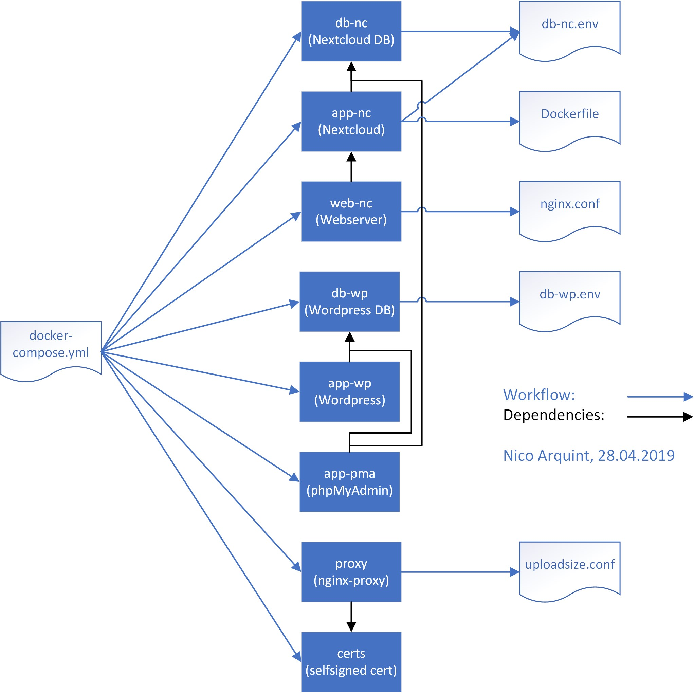

# TBZ-M300-LB3

Anderes Repository (LB2): <https://github.com/NiArq/TBZ-M300>

 

## Inhaltsverzeichnis

- [TBZ-M300-LB3](#tbz-m300-lb3)
  - [Inhaltsverzeichnis](#inhaltsverzeichnis)
  - [K1 - Toolumgebung](#k1---toolumgebung)
    - [Docker for Windows](#docker-for-windows)
    - [Hyper-V](#hyper-v)
  - [K2 - Infrastruktur](#k2---infrastruktur)
    - [Containerisierung](#containerisierung)
    - [Docker](#docker)
    - [Microservices](#microservices)
  - [K3 - Container](#k3---container)
    - [Container](#container)
    - [Volumes](#volumes)
    - [Netzwerkplan](#netzwerkplan)
      - [Legende](#legende)
      - [Netzwerk](#netzwerk)
    - [Schichtenmodell](#schichtenmodell)
    - [Workflow](#workflow)
    - [Umgebungsvariablen](#umgebungsvariablen)
    - [Häufige Befehle](#häufige-befehle)
    - [Testfälle](#testfälle)
  - [K4 - Sicherheit](#k4---sicherheit)
  - [K5 - Allgemein](#k5---allgemein)
  - [K6 - Zusatz](#k6---zusatz)

 
 

## K1 - Toolumgebung
VS Code, Git-Client, Markdown-Editor und SSH-Keys gleichbleibend wie in [LB2](..\LB2).

| Kategorie          | Produkt                                              |
| ------------------ | ---------------------------------------------------- |
| Versionsverwaltung | [Git](https://git-scm.com/)                          |
| Hypervisor         | Hyper-V by Windows (Windows Feature)                 |
| Container Engine   | [Docker for Windows](https://www.docker.com/)        |
| Editor / IDE       | [Visual Studio Code](https://code.visualstudio.com/) |
| Markdown-Editor    | [Typora](https://typora.io/)                         |

 

### Docker for Windows
Im Gegensatz zu LB2 habe ich mich entschieden, [Docker for Windows](https://www.docker.com/) zu installieren, statt eine Linux-VM mit Docker über Vagrant/Virtualbox laufen zu lassen. \
Das aus dem simplen Grund, dass alles nur noch komplizierter wird, wenn ich zusätzlich noch eine VM zwischen mir und den Container habe. Ebenfalls habe ich auch schon von den anderen Mitschülern gehört, dass sie mit der Linux-VM und Docker Probleme haben, da sie zusätzlich noch mit der VM klarkommen müssen.

 

### Hyper-V
Und weil ich _Docker for Windows_ verwende, musste ich den Hypervisor von VirtualBox zu Hyper-V von Windows wechseln (andere Hypervisor werden nicht unterstützt). Dazu muss lediglich das Windows-Feature aktiviert werden (mit der Docker-Installtion wird das automatisch aktiviert).

Voraussetzung für Docker und Hyper-V ist, dass man Windows 10 Pro, Education oder Enterprise hat. Da Hyper-V nur auf diesen Versionen verfügbar ist.

 
 

## K2 - Infrastruktur

|        |                                   |
| ------ | --------------------------------- |
| GitHub | https://github.com/NiArq/TBZ-M300 |
| Git    | https://git-scm.org/              |

 

### Containerisierung
Zuvor hatte ich nie grossartig mit Container gearbeitet. Durch die Applikationsentwickler im Betrieb kannte ich schon vorher ein wenig was ein Container ist.

Im Gegensatz zu VMs benötigen Container keine Hypervisor und sind ziemlich ressourcensparend. Sind aber jedoch in gewissen Hinsichten eingeschränkt(er). \
Erwähnenswert ist auch, dass sobald ein Container heruntergefahren wird, alle Daten dabei gelöscht werden. Bei einer VM bleiben die Daten im Normalfall bestehen.

Zudem gewährleisten Container die Trennung/Verwaltung der genutzten Ressourcen. Ebenfalls können so Programme ausgeführt werden, welche sich in einer geschützen Umgebung befinden. Sollte etwas schieflaufen (Hacker, Virus, etc.), passiert dem Host-System (und den anderen Containern) nichts.

 

### Docker
Ich kannte zwar _Docker_ schon vorher, hatte es aber noch nie verwendet. Ich wusste dass es mit Container arbeitet und dass wir es im Betrieb einzesetzen, mehr aber nicht.

Docker ist eine OpenSource-Software, welches die Bereitstellung von Anwendungen vereinfacht. Es arbeitet mit Container, welche die Anwendung inkl. Abhänigkeiten beinhalten. Somit ist es ziemlich leicht das Ganze zu transportieren und zu installieren.

Die Applikationsentwickler bei uns verwenden es unter anderem um ihre Applikationen zu testen.

 

### Microservices
Man unterscheidet heutzutage zwischen zwei Architekturen:
- Monolithische Architektur
- Microservice Architektur

Eine monolithische Applikation kann meist nur _horizontal_ erweitert werden (mehr Leistung --> CPU, RAM, Speicher, etc.). Hingegen ein Microservice sich auch über mehrere Host erweitern lässt (_horizontal_). Zudem können bei einer Microservice-Applikation auch nur die einzelnen Services hochskaliert werden.

Bei Applikationen basierend auf Microservices ist die ganze Applikation in verschiedene kleine "Sub-Applikationen" (sog. _Microservices_) aufgeteilt.

Beispielsweise bei einem Online-Shop benötigt es einen Weboberfläche, die Buchhaltung, den Bestand und die Lieferung. \
Diese können nun in 4 Microservices aufgeteilt werden: Weboberfäche, Buchhaltung, Bestand und Lieferung. \
Das führt dazu, dass die Programmierung und Wartung der ganzen Applikation einfacher wird, da das Ganze in 4 Services aufgeteilt wurden. Der Nachteil ist, dass eine Schnittstelle für die Kommunkation zwischen den Microservices benötigt wird und dass die Services auch bei Teil-Ausfällen funktionieren müssen (--> kein Abstürzen).

 
 

## K3 - Container

### Container
Es werden insgesamt 8 Container via `docker-compose.yml` aufgebaut:

| Container | Verwendung              |
| --------- | ----------------------- |
| `db-nc`   | Datenbank für Nextcloud |
| `app-nc`  | Nextcloud Applikation   |
| `web-nc`  | Webserver für Nextcloud |
| `db-wp`   | Datenbank für Wordpress |
| `app-wp`  | Wordpress Applikation   |
| `app-pma` | phpMyAdmin              |
| `proxy`   | nginx-Reverse Proxy     |
| `certs`   | Self-signed Zertifikat  |

Es werden dabei keine Dockerfiles genutzt, stattdessen wird alles mittels `docker-compose` gelöst.

 

### Volumes
Damit die Daten beim stoppen nicht verloren gehen, werden mittel Volumes persistente Speicher erstellt:

| Volume                    | Nutzung                       |
| ------------------------- | ----------------------------- |
| `db-nc`                   | Speicher für die Nextcloud DB |
| `nextcloud`               | Nextcloud Daten               |
| `./web-nc/nginx.conf`     | nginx.conf für `web-nc`       |
| `db-wp`                   | Speicher für die Wordpress DB |
| `wp-data`                 | Wordpress Daten               |
| `certs`                   | Zertifikate                   |
| `./proxy/uploadsize.conf` | uploadsize.conf für `proxy`   |
| `vhost.d`                 | nginx-proxy Daten             |
| `html`                    | nginx-proxy Daten             |
| `/var/run/docker.sock`    | Docker-Daemon Socket (API)    |

 

### Netzwerkplan
<kbd></kbd> \
*Abbildung 1: Netzwerkplan der Umsetzung*

Wie im Netzwerkplan ersichtlich - und wie in [K1](#K1) bereits beschrieben - wird Docker nicht in einer VM, sondern direkt auf dem OS laufen gelassen.

#### Legende
Die schwarzen Pfeile zeigen die Kommunikation (vgl. Kabel in einem "Hardware"-Netzwerkplan). Die blauen Pfeile zeigen die Abhängigkeiten (kann nur starten, sofern die Abhänigkeit gestartet ist).

#### Netzwerk
Da alle Container mit einem docker-compose.yml gebaut werden, können alle untereinander intern kommunizieren. Wird kein Port oder Netzwerk definiert, können die Container nicht nach aussen interagieren. Beispielsweise müssen alle Webserver (web-nc, app-wp, app-pma) das Netzwerk des Proxys und zusätzlich den "default"-Netzwerk haben, da sie ansonsten keine Verbindung aufbauen können.

 

### Schichtenmodell
<kbd></kbd> \
*Abbildung 2: Verwendetes Schichtenmodell --> ohne VirtualBox/Vagrant*

Das Schichtenmodell zeigt lediglich den Aufbau von _Docker für Windows_. Zu unterst die Infrastruktur/Hardware, danach ein Betriebssysten, Container Engine/Docker und darauf die Container.

 

### Workflow
<kbd></kbd> \
*Abbildung 3: Workflow*

<!-- TODO: Change Workflow-Diagramm (No Dockerfile) -->

Es wird eine `docker-compose.yml`-Datei verwendet, um mehrere Container zu erstellen. In der Abbildung 3 sieht man den Workflow zur Container-Aufbau. \
Die YAML-Datei erstellt die Container, resp. baut sie nach hinterlegten Dockerfile auf, welche wiederum ggf. auf Datein zugreifen können.

 

### Umgebungsvariablen

Die Umgebungsvariablen werden entweder direkt im `docker-compose.yml` oder in einem `.env`-File definiert. \
Verwendete Umgebungsvariablen:

| Env-Variable            | Nutzende Container            | Beschreibung                                 |
| ----------------------- | ----------------------------- | -------------------------------------------- |
| `MYSQL_ROOT_PASSWORD`   | `db-nc`, `app-nc`, `db-wp`    | Root-Passwort für die MariaDB-Datenbank      |
| `MYSQL_PASSWORD`        | `db-nc`, `app-nc`, `db-wp`    | Passwort für den erstellten User             |
| `MYSQL_DATABASE`        | `db-nc`, `app-nc`, `db-wp`    | Zu erstellende Datenbank                     |
| `MYSQL_USER`            | `db-nc`, `app-nc`, `db-wp`    | Zu erstellender User                         |
| `VIRTUAL_HOST`          | `web-nc`, `app-wp`, `app-pma` | Hostname/(Sub-)Domain des Containers (Proxy) |
| `WORDPRESS_DB_HOST`     | `app-wp`                      | DB Host (Container Name)                     |
| `WORDPRESS_DB_USER`     | `app-wp`                      | DB User                                      |
| `WORDPRESS_DB_NAME`     | `app-wp`                      | DB Name                                      |
| `WORDPRESS_DB_PASSWORD` | `app-wp`                      | DB Datenbank                                 |
| `PMA_HOSTS`             | `app-pma`                     | Datenbanken für phpMyAdmin (Container Namen) |
| `SSL_SUBJECT`           | `certs`                       | Domain für das Zertifikat                    |
| `CA_SUBJECT`            | `certs`                       | Antragssteller                               |
| `SSL_KEY`               | `certs`                       | Speicherort .key-File                        |
| `SSL_CSR`               | `certs`                       | Speicherort .csr-File                        |
| `SSL_CERT`              | `certs`                       | Speicherort .crt-File                        |

 

### Häufige Befehle

**Docker**

| Befehl         | Beschreibung                                    |
| -------------- | ----------------------------------------------- |
| `docker run`   | Führt einen Befehl in einem neuen Container aus |
| `docker start` | Startet einen oder mehrere Container            |
| `docker stop`  | Stoppt einen oder mehrere Container             |
| `docker build` | Baut eine Image aus dem Dockerfile              |
| `docker pull`  | Lädt Image aus einer Repository herunter        |
| `docker push`  | Lädt Image in eine Repository hoch              |

Wenn man `docker` in die Befehlszeile eingibt, erhält man eine Übersicht aller Befehle. \

**Docker-Compose**

| Befehl                   | Beschreibung                               |
| ------------------------ | ------------------------------------------ |
| `docker-compose build`   | Baut Service auf                           |
| `docker-compose up`      | Erstellt und startet Container             |
| `docker-compose down`    | Stoppt und entfernt Container, inkl. Daten |
| `docker-compose events`  | Real-Time Logs                             |
| `docker-compose kill`    | "Killt" Container (erzwingt Stop)          |
| `docker-compose pause`   | Pausiert Service                           |
| `docker-compose restart` | Startet Service neu                        |
| `docker-compose start`   | Startet Container                          |
| `docker-compose stop`    | Stoppt Container                           |

Wenn man `docker-compose` in die Befehlszeile eingibt, erhält man eine Übersicht aller Befehle.

 

### Testfälle
**Testfall 1: Websites aufrufen** \
Voraussetzungen: Container sind gestartet.

| Nr. | Testfall                                           | Erwartet                                        | Effektiv                          |   OK   |
|:---:|----------------------------------------------------|-------------------------------------------------|-----------------------------------|:------:|
| 1.1 | Nextcloud aufrufbar:  http://nc.network.local   | Seite wird geöffnet  Keine 500-Fehlermeldung | Seite wird ohne Probleme geöffnet | **OK** |
| 1.2 | Wordpress aufrufbar:  http://wp.network.local   | Seite wird geöffnet  Keine 500-Fehlermeldung | Seite wird ohne Probleme geöffnet | **OK** |
| 1.3 | phpMyAdmin aufrufbar:  http://pma.network.local | Seite wird geöffnet  Keine 500-Fehlermeldung | Seite wird ohne Probleme geöffnet | **OK** |

**Testfall 2: Proxy** \
Voraussetzungen: Container sind gestartet.

| Nr. | Testfall                                       | Erwartet                                                                   | Effektiv                                            |   OK   |
|:---:|------------------------------------------------|----------------------------------------------------------------------------|-----------------------------------------------------|:------:|
| 2.1 | Ports 80, 443 offen:  HTTP/S-Seite aufrufen | Seite werden geöffnet  Keine Fehlermeldungen (ausser Zerti)             | Seite wird ohne Probleme geöffnet                   | **OK** |
| 2.2 | HTTP-Weiterleitung:  HTTP --> HTTPS         | Wird die HTTP-Seite aufgerufen,  wird man zur HTTPS-Seite weitergleitet | Alle HTTP-Seiten werden  zu HTTPS weitergeleitet | **OK** |

 
 

## K4 - Sicherheit

 
 

## K5 - Allgemein

 
 

## K6 - Zusatz